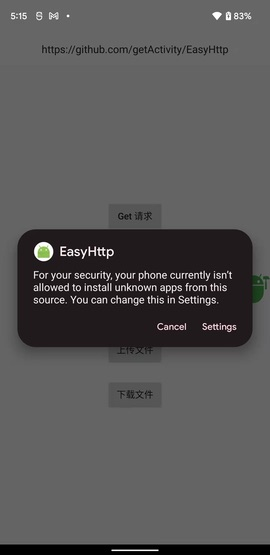
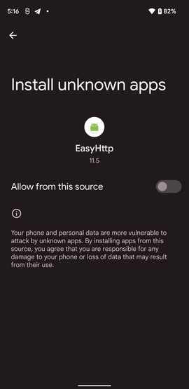
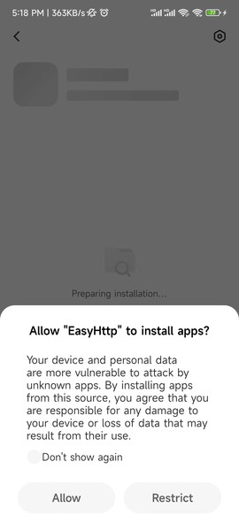
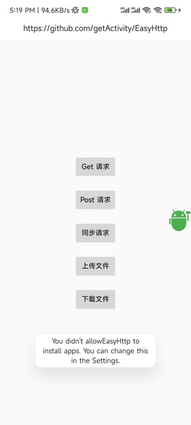

#### Catalog

* [Android 11 location permission adaptation](#android-11-location-permission-adaptation)

* [Android 11 storage permission adaptation](#android-11-storage-permission-adaptation)

* [When do I need to adapt to the characteristics of partitioned storage](#when-do-i-need-to-adapt-to-the-characteristics-of-partitioned-storage)

* [Why does the app restart after Android 11 grants the install permission](#why-does-the-app-restart-after-android-11-grants-the-install-permission)

* [Why is the storage permission granted but the permission setting page still shows unauthorized](#why-is-the-storage-permission-granted-but-the-permission-setting-page-still-shows-unauthorized)

* [What should I do if the dialog box pops up before and after the permission application](#what-should-i-do-if-the-dialog-box-pops-up-before-and-after-the-permission-application)

* [How to know in the callback which permissions are permanently denied](#how-to-know-in-the-callback-which-permissions-are-permanently-denied)

* [Why does the new version of the framework remove the function of automatically applying for AndroidManifest permissions](#why-does-the-new-version-of-the-framework-remove-the-function-of-automatically-applying-for-androidmanifest-permissions)

* [Why does the new version of the framework remove the function of constantly applying for permissions](#why-does-the-new-version-of-the-framework-remove-the-function-of-constantly-applying-for-permissions)

* [Why not use ActivityResultContract to request permission](#why-not-use-activityresultcontract-to-request-permission)

* [How to deal with the problem that the permission request is successful but the blank pass is returned](#how-to-deal-with-the-problem-that-the-permission-request-is-successful-but-the-blank-pass-is-returned)

* [Why cannot I access the files in the Android/data directory after authorization](#why-cannot-i-access-the-files-in-the-androiddata-directory-after-authorization)

* [Is there any problem with skipping the installation permission application and installing the apk directly](#Is-there-any-problem-with-skipping-the-installation-permission-application-and-installing-the-apk-directly)

#### Android 11 Location Permission Adaptation

* On Android 10, positioning permissions are divided into foreground permissions (precise and fuzzy) and background permissions, while on Android 11, you need to apply for these two permissions separately. If you apply for these two permissions ** Ruthlessly rejected by the system ** at the same time, even the permission application dialog box will not pop up, and the system will reject it immediately. It directly leads to the failure of location permission application.

* If you are using the latest version of **XXPermissions**, you ** Congratulations ** can directly pass the foreground and background positioning permissions to the framework. The framework has automatically applied for these two permissions separately for you. The whole adaptation process ** Zero cost **.

* However, it should be noted that the application process is divided into two steps. The first step is to apply for the foreground location permission, and the second step is to apply for the background location permission. The user must first agree to the foreground location permission before entering the application for the background location permission. There are two ways to approve the foreground location permission: check `Allow only while using the app` or `Ask every time`. In the background location permission application, the user must check `Allow all the time`. Only in this way can the background location permission application be approved.

* And if your application only needs to use the location function in the foreground, but does not need to use the location function in the background, please do not apply for `Permission.ACCESS_BACKGROUND_LOCATION` permission.

 

#### Android 11 storage permission adaptation

* If your project needs to adapt to Android 11storage permissions, you need to upgrade targetSdkVersion first.

```groovy
android 
    defaultConfig {
        targetSdkVersion 30
    }
}
```

* Add Android 11storage permissions to register in the manifest file.

```xml
<uses-permission android:name="android.permission.MANAGE_EXTERNAL_STORAGE" />
```

* It should be noted that the old version of the storage permissions also need to be registered in the manifest file, because the framework will automatically switch to the old version of the application mode when applying for storage permissions in an environment lower than Android 11.

```xml
<uses-permission android:name="android.permission.READ_EXTERNAL_STORAGE" />
<uses-permission android:name="android.permission.WRITE_EXTERNAL_STORAGE" />
```

* You also need to add this attribute to the manifest file, otherwise you won't be able to read and write files on external storage on Android 10 devices.

```xml
<application
    android:requestLegacyExternalStorage="true">
```
    
* Finally, call the following code directly.

```java
XXPermissions.with(MainActivity.this)
        // The scoped storage that has been adapted to Android 11 needs to be called like this
        //.permission(Permission.Group.STORAGE)
        // Not yet adapted to Android 11 scoped storage needs to be called like this
        .permission(Permission.MANAGE_EXTERNAL_STORAGE)
        .request(new OnPermissionCallback() {

            @Override
            public void onGranted(@NonNull List<String> permissions, boolean allGranted) {
                if (allGranted) {
                    toast("获取存储权限成功");
                }
            }
        });
```


#### When do I need to adapt to the characteristics of partitioned storage

* If your app needs to be available on Google Play, you need to check it out in detail: [ Google App Store policy (need to climb over the wall) ](https://support.google.com/googleplay/android-developer/answer/9956427). [ Google Play notifications ](https://developer.android.google.cn/training/data-storage/manage-all-files#all-files-access-google-play)

* The origin of scoped storage: Google has received many complaints from users before, saying that many applications create directories and files under the SD card, which makes it very troublesome for users to manage mobile phone files (there are so many foreign netizens with obsessive-compulsive disorder, ha ha), so in the Android 10 version update. Google requires all developers to store media files in their own internal directory or in the internal directory of the SD card, but Google has adopted a relaxed policy on one version, adding `android:requestLegacyExternalStorage="true"` the adaptation of this feature to the manifest file, but on Android 11, you have two options:

    1. Adapting scoped storage: This is a method recommended by Google, but it will increase the workload, because it is very troublesome to adapt scoped storage, which is my personal feeling. However, for some specific applications, such as file managers, backup and recovery applications, anti-virus applications, document management applications, on-device file search, disk and file encryption, device-to-device data migration and so on, they must use external storage, which requires the second way to achieve.

    2. Apply for external storage permissions: This is a way that Google does not recommend. It only needs `MANAGE_EXTERNAL_STORAGE` permissions, and there is basically no pressure to adapt. However, there will be a problem, that is, when it is put on the Google App Market, it must be reviewed and approved by Google Play.

* To sum up, I think both are good and bad, but I can share my views with you.

    1. If your app needs to be on the Google Apps Marketplace, you need to adapt to partitioned storage as soon as possible, because Google is really doing it this time.

    2. If your application is only available in the china application market, and there is no subsequent need to be available in the Google application market, then you can also directly apply for `MANAGE_EXTERNAL_STORAGE` permission to read and write external storage.

#### Why does the app restart after Android 11 grants the install permission

* [Android 11 feature adjustment, installation of external source application requires restarting App](https://cloud.tencent.com/developer/news/637591)

* First of all, this problem is a new feature of Android 11, not caused by the framework. Of course, there is no way to avoid this problem, because the application is killed by the system, and the level of the application is certainly not as high as that of the system. At present, there is no solution for this in the industry. If you have a good solution, you are welcome to provide it to me.

* In addition, after practice, this problem will no longer appear on Android 12, proving that the problem has been fixed by Google.

#### Why is the storage permission granted but the permission setting page still shows unauthorized

* First of all, I need to correct a wrong idea. `READ_EXTERNAL_STORAGE` `WRITE_EXTERNAL_STORAGE` These two permissions and `MANAGE_EXTERNAL_STORAGE` permissions are two different things. Although they are both called storage permissions, they belong to two completely different permissions. If you apply for `MANAGE_EXTERNAL_STORAGE` permission and grant permission, However, you do not see that the permission has been granted on the permission setting page. Please note that this situation is normal, because what you see on the permission setting page is the storage grant status `READ_EXTERNAL_STORAGE` and `WRITE_EXTERNAL_STORAGE` permission status, not `MANAGE_EXTERNAL_STORAGE` the permission status, but at this time, the storage permission has been obtained. You don't have to worry about the permission status displayed on the permission setting page. You can read and write files directly. There will be no permission problem.

* One more question, why only appear on devices above Android 11? First of all `MANAGE_EXTERNAL_STORAGE`, only Android 11 has permission. Android 10 and previous versions do not have this permission. If you apply for `MANAGE_EXTERNAL_STORAGE` permission on a lower version device, the framework will help you do downward compatibility. Will automatically help you replace `READ_EXTERNAL_STORAGE`, `WRITE_EXTERNAL_STORAGE` permissions to apply, this time you see the permission settings page of the storage permission status must be normal, which is why you only see this problem in Android 11 and above devices.

#### What should I do if the dialog box pops up before and after the permission application

* An interceptor interface is provided inside the framework. It is enough to implement the interface provided [ IPermissionInterceptor ](/library/src/main/java/com/hjq/permissions/IPermissionInterceptor.java) in the framework. For specific implementation, please refer to the [ PermissionInterceptor ](app/src/main/java/com/hjq/permissions/demo/PermissionInterceptor.java) class provided in Demo. It is recommended to download the source code and read it, and then introduce the code into the project

* The way to use interception is also very simple. There are two specific settings, one for local settings and the other for global settings.

```java
XXPermissions.with(this)
        .permission(Permission.XXX)
        // Set permission request interceptor (local settings)
        .interceptor(new PermissionInterceptor())
        .request(new OnPermissionCallback() {

            @Override
            public void onGranted(@NonNull List<String> permissions, boolean allGranted) {
                ......
            }

            @Override
            public void onDenied(@NonNull List<String> permissions, boolean doNotAskAgain) {
                ......
            }
        });
```

```java
public class XxxApplication extends Application {

    @Override
    public void onCreate() {
        super.onCreate();
        
        // Set permission request interceptor (global setting)
        XXPermissions.setInterceptor(new PermissionInterceptor());
    }
}
```

#### How to know in the callback which permissions are permanently denied

* Requirement scenario: Suppose you apply for calendar permission and recording permission at the same time, but both are rejected by the user. However, one of the two groups of permissions is permanently rejected. How to determine whether a certain group of permissions is permanently rejected? Here is a code example:

```java
XXPermissions.with(this)
        .permission(Permission.RECORD_AUDIO)
        .permission(Permission.Group.CALENDAR)
        .request(new OnPermissionCallback() {

            @Override
            public void onGranted(@NonNull List<String> permissions, boolean allGranted) {
                if (allGranted) {
                    toast("Acquired recording and calendar permissions successfully");
                }
            }

            @Override
            public void onDenied(@NonNull List<String> permissions, boolean doNotAskAgain) {
                if (doNotAskAgain && permissions.contains(Permission.RECORD_AUDIO) &&
                        XXPermissions.isPermanentDenied(MainActivity.this, Permission.RECORD_AUDIO)) {
                    toast("Recording permission has been permanently denied");
                }
            }
        });
```

#### Why does the new version of the framework remove the function of automatically applying for AndroidManifest permissions

> [ [Issue] It is recommended to restore the two practical functions of jumping to the permission setting page and obtaining all permissions of AndroidManifest](https://github.com/getActivity/XXPermissions/issues/54)

* The function of obtaining the list permission and applying. Although this is very convenient, there are some hidden dangers. Because the list file in apk is ultimately merged by the list files of multiple modules, it will become uncontrollable. This will make it impossible for us to predict the permissions applied for, and it will also mix some unnecessary permissions. Therefore, after careful consideration, this function will be removed.

#### Why does the new version of the framework remove the function of constantly applying for permissions

> [ [Issue] Optimization issue with keep requesting get after permission denied](https://github.com/getActivity/XXPermissions/issues/39)

* Assuming that the user refuses the permission, if the framework applies again, the possibility that the user will grant it is relatively small. At the same time, some app stores have disabled this behavior. After careful consideration, the API related to this function will be removed.

* If you still want to use this way to apply for permission, in fact, there is no way, you can refer to the following ways to achieve.

```java
public class PermissionActivity extends AppCompatActivity implements OnPermissionCallback {

    @Override
    public void onClick(View view) {
        requestCameraPermission();
    }

    private void requestCameraPermission() {
        XXPermissions.with(this)
                .permission(Permission.CAMERA)
                .request(this);
    }

    @Override
    public void onGranted(@NonNull List<String> permissions, boolean allGranted) {
        if (allGranted) {
            toast("Successfully obtained permission to take camera");
        }
    }

    @Override
    public void onDenied(@NonNull List<String> permissions, boolean doNotAskAgain) {
        if (doNotAskAgain) {
            toast("Authorization is permanently denied, please manually grant permission to take camera");
            // If it is permanently denied, jump to the application permission system settings page
            XXPermissions.startPermissionActivity(MainActivity.this, permissions);
        } else {
            requestCameraPermission();
        }
    }
    
    @Override
    protected void onActivityResult(int requestCode, int resultCode, @Nullable Intent data) {
        super.onActivityResult(requestCode, resultCode, data);
        if (requestCode != XXPermissions.REQUEST_CODE) {
            return;
        }
        toast("Detected that you just returned from the permission settings interface");
    }
}
```

#### Why not use ActivityResultContract to request permission

> [ [Issue] Whether the permission application for onActivityResult callback has been considered and switched to ActivityResultContract](https://github.com/getActivity/XXPermissions/issues/103)

* Activity ResultContract is a new API added in Activity `1.2.0-alpha02` and Fragment `1.3.0-alpha02`, which has a certain threshold for use, and the project must be based on Android X. And the version of Android X must be `1.3.0-alpha01` above. If it is replaced `ActivityResultContract`, some developers will not be able to use **XXPermissions**, which is a serious problem. But in fact, changing to Activity ResultContract does not bring any benefits. For example, I have solved the problems of Fragment screen rotation and background application before, so what is the significance of changing? Some people may say that the official onActivityResult has been marked as obsolete. Don't worry. The reason why it is marked as obsolete is just for Google to promote new technology. But it can be clearly said that the official will not delete this API. More accurately, it will not dare. Why? You can see how Activity ResultContract is implemented? It is also implemented by rewriting the `onRequestPermissionsResult` method callback of the Activity `onActivityResult`. You can see the implementation of these two methods in the `androidx.activity.ComponentActivity` class, which will not be repeated here.

#### How to deal with the problem that the permission request is successful but the blank pass is returned

* There is no solution to this problem. The permission request framework can only help you apply for permission. As for what you do when you apply for permission, the framework cannot know or intervene. The return of the blank pass is the manufacturer's own behavior. The purpose is to protect the user's privacy, because it cannot be used without permission in some applications. The return of the blank pass is to avoid this situation. You want to ask me what to do? I can only say that the arm can't resist the thigh, so don't make some unnecessary resistance.

#### Why cannot I access the files in the Android/data directory after authorization

* First of all, no matter what kind of storage permission you apply for, you cannot directly read the android/data directory on Android 11. This is a new feature on Android 11, and you need to make additional adaptation. You can refer to this open source project for the specific adaptation process.

#### Is there any problem with skipping the installation permission application and installing the apk directly

* If you are careful, you may find that you can install apk without installation permissions. So why should I apply for `REQUEST_INSTALL_PACKAGES` permissions? Isn't that unnecessary?

* Here I want to say, is not what you imagine, next let us experiment, here selected `Google piexl 3XL (Android 12)` and `Xiaomi phone 12 (Android 12)` respectively do a test

```java
Intent intent = new Intent(Intent.ACTION_VIEW);
Uri uri;
if (Build.VERSION.SDK_INT >= Build.VERSION_CODES.N) {
    uri = FileProvider.getUriForFile(context, context.getPackageName() + ".provider", file);
} else {
    uri = Uri.fromFile(file);
}

intent.setDataAndType(uri, "application/vnd.android.package-archive");
intent.addFlags(Intent.FLAG_ACTIVITY_NEW_TASK);
intent.addFlags(Intent.FLAG_GRANT_READ_URI_PERMISSION | Intent.FLAG_GRANT_WRITE_URI_PERMISSION);
context.startActivity(intent);
```

 

 

* See here, I believe you have noticed some differences, also jump to install apk page, on the Android native system, will show the `Cancel` and `Settings` option, click `Cancel` option will cancel the installation, only click `Settings` option, will let you grant the installation package permissions, On top of miui, the `Allow` and `Restrict` options are displayed, as well as a `Don't show again` option. If the user checks `Don't show again` and clicks the `Restrict` option, The next time the application goes to the install apk page, it will be directly rejected by the system, and only a toast prompt will be displayed. The conclusion of the problem is: You can directly jump to the page of installing apk, but it is not recommended to do so, because on some mobile phones, the system may directly reject the request to install apk, so the standard writing should be, first judge whether there is no installation permission, if not, apply for, if there is, then jump to the page of installing apk.