# [中文文档](README.md)

# Permission request framework


* project address: [Github](https://github.com/getActivity/XXPermissions)

* [Click here to download demo apk directly](https://github.com/getActivity/XXPermissions/releases/download/18.0/XXPermissions.apk)

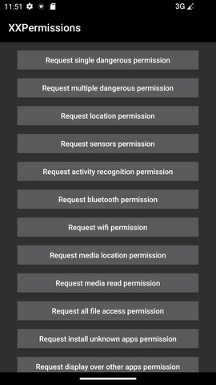 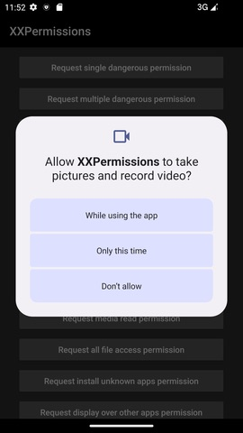 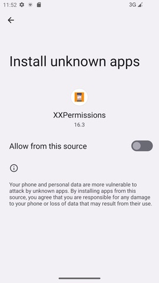

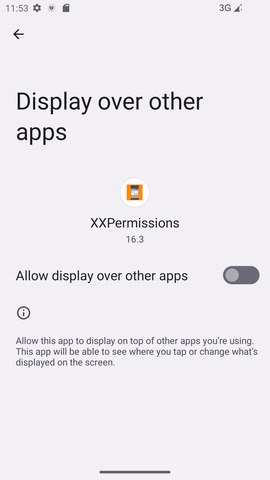 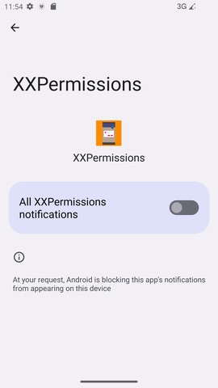 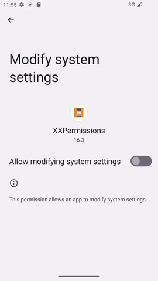

 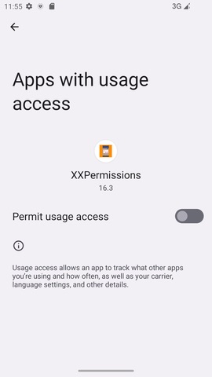 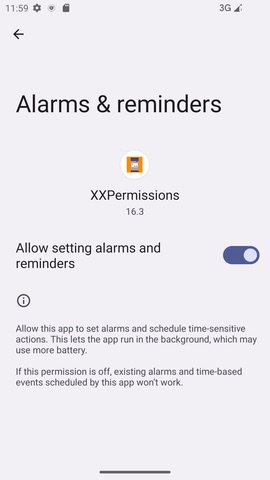

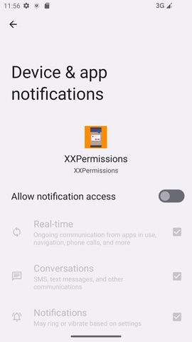 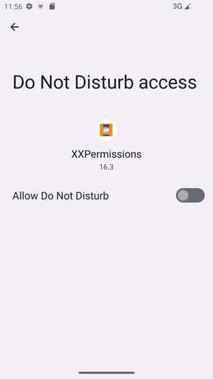 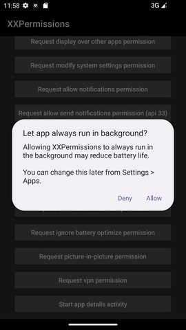

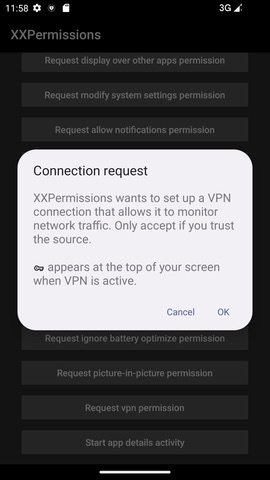 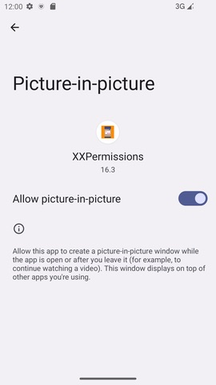

#### Integration steps

* If your project Gradle configuration is in `7.0` below, needs to be in `build.gradle` file added

```groovy
allprojects {
    repositories {
        // JitPack remote repository：https://jitpack.io
        maven { url 'https://jitpack.io' }
    }
}
```

* If your Gradle configuration is `7.0` or above, needs to be in `settings.gradle` file added

```groovy
dependencyResolutionManagement {
    repositories {
        // JitPack remote repository：https://jitpack.io
        maven { url 'https://jitpack.io' }
    }
}
```

* After configuring the remote warehouse, under the project app module `build.gradle` Add remote dependencies to the file

```groovy
android {
    // Support JDK 1.8
    compileOptions {
        targetCompatibility JavaVersion.VERSION_1_8
        sourceCompatibility JavaVersion.VERSION_1_8
    }
}

dependencies {
    // Permission request framework：https://github.com/getActivity/XXPermissions
    implementation 'com.github.getActivity:XXPermissions:18.0'
}
```

#### AndroidX compatible

* If the project is based on **AndroidX** package, please in the item `gradle.properties` file added

```text
# Indicates migration of third-party libraries to AndroidX
android.enableJetifier = true
```

* If the project is based on **Support** Packages do not need to be added to this configuration

#### scoped storage

* If the project has been adapted to the Android 10 scoped storage feature, please go to`AndroidManifest.xml`join in

```xml
<manifest>

    <application>

        <!-- Inform XXPermissions that the current project has adapted to the scoped storage feature -->
        <meta-data
            android:name="ScopedStorage"
            android:value="true" />

    </application>

</manifest>
```

* If the current project does not adapt to this feature, then this step can be ignored

* It should be noted that this option is used by the framework to determine whether the current project is adapted to scoped storage. It should be noted that if your project has been adapted to the scoped storage feature, you can use`READ_EXTERNAL_STORAGE`、`WRITE_EXTERNAL_STORAGE`To apply for permission, if your project has not yet adapted to the partition feature, even if you apply`READ_EXTERNAL_STORAGE`、`WRITE_EXTERNAL_STORAGE`The permissions will also cause the files on the external storage to be unable to be read normally. If your project is not suitable for scoped storage, please use`MANAGE_EXTERNAL_STORAGE`To apply for permission, so that the files on the external storage can be read normally. If you want to know more about the features of Android 10 partition storage, you can[Click here to view and learn](https://github.com/getActivity/AndroidVersionAdapter#android-100).

#### One code to get permission request has never been easier

* Java code example

```java
XXPermissions.with(this)
        // Request single permission
        .permission(Permission.RECORD_AUDIO)
        // Request multiple permission
        .permission(Permission.Group.CALENDAR)
        // Set permission request interceptor (local settings)
        //.interceptor(new PermissionInterceptor())
        // Setting does not trigger error detection mechanism (local setting)
        //.unchecked()
        .request(new OnPermissionCallback() {

            @Override
            public void onGranted(@NonNull List<String> permissions, boolean allGranted) {
                if (!allGranted) {
                    toast("Some permissions were obtained successfully, but some permissions were not granted normally");
                    return;
                }
                toast("Acquired recording and calendar permissions successfully");
            }

            @Override
            public void onDenied(@NonNull List<String> permissions, boolean doNotAskAgain) {
                if (doNotAskAgain) {
                    toast("Authorization denied permanently, please grant recording and calendar permissions manually");
                    // If it is permanently denied, jump to the application permission system settings page
                    XXPermissions.startPermissionActivity(context, permissions);
                } else {
                    toast("Failed to get recording and calendar permissions");
                }
            }
        });
```

* Kotlin code example

```kotlin
XXPermissions.with(this)
    // Request single permission
    .permission(Permission.RECORD_AUDIO)
    // Request multiple permission
    .permission(Permission.Group.CALENDAR)
    // Set permission request interceptor (local settings)
    //.interceptor(new PermissionInterceptor())
    // Setting does not trigger error detection mechanism (local setting)
    //.unchecked()
    .request(object : OnPermissionCallback {

        override fun onGranted(permissions: MutableList<String>, allGranted: Boolean) {
            if (!allGranted) {
                toast("Some permissions were obtained successfully, but some permissions were not granted normally")
                return
            }
            toast("Acquired recording and calendar permissions successfully")
        }

        override fun onDenied(permissions: MutableList<String>, doNotAskAgain: Boolean) {
            if (doNotAskAgain) {
                toast("Authorization denied permanently, please grant recording and calendar permissions manually")
                // If it is permanently denied, jump to the application permission system settings page
                XXPermissions.startPermissionActivity(context, permissions)
            } else {
                toast("Failed to get recording and calendar permissions")
            }
        }
    })
```

#### Introduction to other APIs of the framework

```java
// Determine if one or more permissions are all granted
XXPermissions.isGranted(Context context, String... permissions);

// Get permission not granted
XXPermissions.getDenied(Context context, String... permissions);

// Determine whether a permission is a special permission
XXPermissions.isSpecial(String permission);

// Determine if one or more permissions have been permanently denied (It must be called in the callback method of the permission application to have an effect)
XXPermissions.isPermanentDenied(Activity activity, String... permissions);

// Start app details activity
XXPermissions.startPermissionActivity(Context context, String... permissions);
XXPermissions.startPermissionActivity(Activity activity, String... permissions);
XXPermissions.startPermissionActivity(Activity activity, String... permission, OnPermissionPageCallback callback);
XXPermissions.startPermissionActivity(Fragment fragment, String... permissions);
XXPermissions.startPermissionActivity(Fragment fragment, String... permissions, OnPermissionPageCallback callback);

// Setting not to trigger error detection mechanism (global setting)
XXPermissions.setCheckMode(false);
// Set permission request interceptor (global setting)
XXPermissions.setInterceptor(new IPermissionInterceptor() {});
```

#### About the permission monitoring callback parameter description

* We all know that if the user grants all it will only call `onGranted` method, which will only be called if the user rejects all `onDenied` method.

* But there is another situation. If multiple permissions are requested, these permissions are not all granted or all denied, but some of the authorizations are partially denied. How will the framework handle the callback?

* The framework will call first `onDenied` method, then call `onGranted` method. of which we can pass `onGranted` in the method `allGranted` parameters to determine whether all permissions are granted.

* If you want to know whether a permission in the callback is granted or denied, you can call `List` in class `contains(Permission.XXX)` method to determine whether this permission is included in this collection.

## [For other frequently asked questions, please click here](HelpDoc-en.md)

#### Comparison between similar permission request frameworks

|                      Adaptation details                       |                                  [XXPermissions](https://github.com/getActivity/XXPermissions)                                 |                                 [AndPermission](https://github.com/yanzhenjie/AndPermission)                                 |                                 [PermissionX](https://github.com/guolindev/PermissionX)                                |                              [AndroidUtilCode-PermissionUtils](https://github.com/Blankj/AndroidUtilCode)                |                                       [PermissionsDispatcher](https://github.com/permissions-dispatcher/PermissionsDispatcher)                                       |                                 [RxPermissions](https://github.com/tbruyelle/RxPermissions)                                |                                   [EasyPermissions](https://github.com/googlesamples/easypermissions)                                  |
| :-----------------------------------------------------------: | :----------------------------------------------------------------------------------------------------------------------------: | :--------------------------------------------------------------------------------------------------------------------------: | :--------------------------------------------------------------------------------------------------------------------: | :----------------------------------------------------------------------------------------------------------------------: | :------------------------------------------------------------------------------------------------------------------------------------------------------------------: | :------------------------------------------------------------------------------------------------------------------------: | :------------------------------------------------------------------------------------------------------------------------------------: |
|                    Corresponding version                      |                                                              18.0                                                              |                                                             2.0.3                                                            |                                                          1.7.1                                                         |                                                          1.31.0                                                          |                                                                                 4.9.2                                                                                |                                                            0.12                                                            |                                                                  3.0.0                                                                 |
|                       Number of issues                        | [](https://github.com/getActivity/XXPermissions/issues) | [](https://github.com/yanzhenjie/AndPermission/issues) | [](https://github.com/guolindev/PermissionX/issues) | [](https://github.com/Blankj/AndroidUtilCode/issues) | [](https://github.com/permissions-dispatcher/PermissionsDispatcher/issues) | [](https://github.com/tbruyelle/RxPermissions/issues) | [](https://github.com/googlesamples/easypermissions/issues) |
|                       Framework volume                        |                                                              82 KB                                                             |                                                            127 KB                                                            |                                                          97 KB                                                         |                                                          500 KB                                                          |                                                                                 99 KB                                                                                |                                                            28 KB                                                           |                                                                  48 KB                                                                 |
|                 Framework Maintenance Status                  |                                                       **In maintenance**                                                       |                                                       stop maintenance                                                       |                                                    **In maintenance**                                                  |                                                     stop maintenance                                                     |                                                                             stop maintenance                                                                         |                                                      stop maintenance                                                      |                                                            stop maintenance                                                            |
|                  Alarm reminder permission                    |                                                                ✅                                                               |                                                               ❌                                                             |                                                            ❌                                                          |                                                             ❌                                                           |                                                                                   ❌                                                                                  |                                                              ❌                                                            |                                                                    ❌                                                                  |
|               All file management permissions                 |                                                                ✅                                                               |                                                               ❌                                                             |                                                            ✅                                                          |                                                             ❌                                                           |                                                                                   ❌                                                                                  |                                                              ❌                                                            |                                                                    ❌                                                                  |
|                 Install package permissions                   |                                                                ✅                                                               |                                                               ✅                                                             |                                                            ✅                                                          |                                                             ❌                                                           |                                                                                   ❌                                                                                  |                                                              ❌                                                            |                                                                    ❌                                                                  |
|                Picture-in-picture permissions                 |                                                                ✅                                                               |                                                               ❌                                                             |                                                            ❌                                                          |                                                             ❌                                                           |                                                                                   ❌                                                                                  |                                                              ❌                                                            |                                                                    ❌                                                                  |
|                 Floating window permissions                   |                                                                ✅                                                               |                                                               ✅                                                             |                                                            ✅                                                          |                                                             ✅                                                           |                                                                                   ✅                                                                                  |                                                              ❌                                                            |                                                                    ❌                                                                  |
|                  System setting permissions                   |                                                                ✅                                                               |                                                               ✅                                                             |                                                            ✅                                                          |                                                             ✅                                                           |                                                                                   ✅                                                                                  |                                                              ❌                                                            |                                                                    ❌                                                                  |
|                 Notification bar permissions                  |                                                                ✅                                                               |                                                               ✅                                                             |                                                            ❌                                                          |                                                             ❌                                                           |                                                                                   ❌                                                                                  |                                                              ❌                                                            |                                                                    ❌                                                                  |
|            Notification bar monitoring permission             |                                                                ✅                                                               |                                                               ✅                                                             |                                                            ❌                                                          |                                                             ❌                                                           |                                                                                   ❌                                                                                  |                                                              ❌                                                            |                                                                    ❌                                                                  |
|                  Do not disturb permission                    |                                                                ✅                                                               |                                                               ❌                                                             |                                                            ❌                                                          |                                                             ❌                                                           |                                                                                   ❌                                                                                  |                                                              ❌                                                            |                                                                    ❌                                                                  |
|            Ignore battery optimization permission             |                                                                ✅                                                               |                                                               ❌                                                             |                                                            ❌                                                          |                                                             ❌                                                           |                                                                                   ❌                                                                                  |                                                              ❌                                                            |                                                                    ❌                                                                  |
|                  View app usage permission                    |                                                                ✅                                                               |                                                               ❌                                                             |                                                            ❌                                                          |                                                             ❌                                                           |                                                                                   ❌                                                                                  |                                                              ❌                                                            |                                                                    ❌                                                                  |
|                       VPN permissions                         |                                                                ✅                                                               |                                                               ❌                                                             |                                                            ❌                                                          |                                                             ❌                                                           |                                                                                   ❌                                                                                  |                                                              ❌                                                            |                                                                    ❌                                                                  |
|               Android 13 Dangerous Permissions                |                                                                ✅                                                               |                                                               ❌                                                             |                                                            ✅                                                          |                                                             ❌                                                           |                                                                                   ❌                                                                                  |                                                              ❌                                                            |                                                                    ❌                                                                  |
|               Android 12 Dangerous Permissions                |                                                                ✅                                                               |                                                               ❌                                                             |                                                            ✅                                                          |                                                             ❌                                                           |                                                                                   ❌                                                                                  |                                                              ❌                                                            |                                                                    ❌                                                                  |
|               Android 11 Dangerous Permissions                |                                                                ✅                                                               |                                                               ❌                                                             |                                                            ✅                                                          |                                                             ❌                                                           |                                                                                   ❌                                                                                  |                                                              ❌                                                            |                                                                    ❌                                                                  |
|               Android 10 Dangerous Permissions                |                                                                ✅                                                               |                                                               ✅                                                             |                                                            ✅                                                          |                                                             ❌                                                           |                                                                                   ✅                                                                                  |                                                              ❌                                                            |                                                                    ❌                                                                  |
|              Android 9.0 Dangerous Permissions                |                                                                ✅                                                               |                                                               ❌                                                             |                                                            ✅                                                          |                                                             ❌                                                           |                                                                                   ✅                                                                                  |                                                              ❌                                                            |                                                                    ❌                                                                  |
|              Android 8.0 Dangerous Permissions                |                                                                ✅                                                               |                                                               ✅                                                             |                                                            ✅                                                          |                                                             ❌                                                           |                                                                                   ✅                                                                                  |                                                              ❌                                                            |                                                                    ❌                                                                  |
| New permissions are automatically compatible with old devices |                                                                ✅                                                               |                                                               ❌                                                             |                                                            ❌                                                          |                                                             ❌                                                           |                                                                                   ❌                                                                                  |                                                              ❌                                                            |                                                                    ❌                                                                  |
|         Screen orientation rotation scene adaptation          |                                                                ✅                                                               |                                                               ✅                                                             |                                                            ✅                                                          |                                                             ❌                                                           |                                                                                   ✅                                                                                  |                                                              ❌                                                            |                                                                    ❌                                                                  |
|    Background application permission scenario adaptation      |                                                                ✅                                                               |                                                               ❌                                                             |                                                            ❌                                                          |                                                             ❌                                                           |                                                                                   ❌                                                                                  |                                                              ❌                                                            |                                                                    ❌                                                                  |
|                Android 12 memory leak bug fix                 |                                                                ✅                                                               |                                                               ❌                                                             |                                                            ❌                                                          |                                                             ❌                                                           |                                                                                   ❌                                                                                  |                                                              ❌                                                            |                                                                    ❌                                                                  |
|                  Error detection mechanism                    |                                                                ✅                                                               |                                                               ❌                                                             |                                                            ❌                                                          |                                                             ❌                                                           |                                                                                   ❌                                                                                  |                                                              ❌                                                            |                                                                    ❌                                                                  |

#### New permissions are automatically compatible with old devices

* With the continuous update of the Android version, dangerous permissions and special permissions are also increasing, so there will be a version compatibility problem at this time. Higher version Android devices support applying for lower version permissions, but lower version Android devices do not support If you apply for a higher version of the permission, then there will be a compatibility problem at this time.

* After verification, other permission frameworks chose the simplest and rude way, which is not to do compatibility, but to the caller of the outer layer for compatibility. The caller needs to judge the Android version in the outer layer first, and upload it on the higher version. Enter new permissions to the framework, and pass the old permissions to the framework on the lower version. This method seems simple and rude, but the development experience is poor. At the same time, it also hides a pit. The outer callers know that the new permissions correspond to Which is the old permission of ? I think not everyone knows it, and once the cognition is wrong, it will inevitably lead to wrong results.

* I think the best way is to leave it to the framework. **XXPermissions** does exactly that. When the outer caller applies for a higher version of the permission, then the lower version of the device will automatically add the lower version of the permission. To apply, to give the simplest example, the new `MANAGE_EXTERNAL_STORAGE` permission that appeared in Android 11, if it is applied for this permission on Android 10 and below devices, the framework will automatically add `READ_EXTERNAL_STORAGE` and `WRITE_EXTERNAL_STORAGE` to apply, in Android On Android 10 and below devices, we can directly use `MANAGE_EXTERNAL_STORAGE` as `READ_EXTERNAL_STORAGE` and `WRITE_EXTERNAL_STORAGE`, because what `MANAGE_EXTERNAL_STORAGE` can do, on Android 10 and below devices, we need to use `READ_EXTERNAL_STORAGE` and `WRITE_EXTERNAL_STORAGE` Only then can it be done.

* So when you use **XXPermissions**, you can directly apply for new permissions. You don’t need to care about the compatibility of old and new permissions. The framework will automatically handle it for you. Unlike other frameworks, What I want to do more is to let everyone handle the permission request with a single code, and let the framework handle everything that the framework can do.

#### Screen rotation scene adaptation introduction

* Rotating the screen of the activity after the system permission application dialog box pops up will cause the permission application callback to fail, because the screen rotation will cause the Fragment in the framework to be destroyed and rebuilt, which will cause the callback object in it to be recycled directly, and eventually cause the callback to be abnormal. There are several solutions, one is to add in the manifest file`android:configChanges="orientation"`Attribute, so that the Activity and Fragment will not be destroyed and rebuilt when the screen is rotated. The second is to fix the direction of the Activity display directly in the manifest file, but the above two solutions must be handled by people who use the framework, which is obviously not flexible enough. The only one who can fix the problem is the one who created the problem, the problem of the framework should be solved by the frame, and **RxPermissions** The solution is to set the PermissionFragment object`fragment.setRetainInstance(true)`, so even if the screen is rotated, the Activity object will be destroyed and rebuilt, and the Fragment will not be destroyed and rebuilt, and the previous object will still be reused, but there is a problem, if the Activity is rewritten **onSaveInstanceState** The method will directly lead to the failure of this method, which is obviously only a temporary solution, but not the root cause. **XXPermissions** way would be more direct, in **PermissionFragment** When bound to an Activity, the current Activity's **Fixed screen orientation**, after the permission application ends, **reset the screen orientation**.

* In all permission request frameworks, this problem occurs as long as Fragment is used to apply for permissions, and AndPermission actually applies for permissions by creating a new Activity, so this problem does not occur. PermissionsDispatcher uses APT to generate code. Apply for permission, so there is no such problem, and PermissionX directly draws on the solution of **XXPermissions**, please see [XXPermissions/issues/49](https://github.com/getActivity/XXPermissions/issues/49)、[PermissionX/issues/51](https://github.com/guolindev/PermissionX/issues/51).

#### Background application permission scenario introduction

* When we apply for permissions after doing time-consuming operations (such as obtaining the privacy agreement on the splash screen page and then applying for permissions), the activity will be returned to the desktop (retired to the background) during the network request process, and then the permission request will be in the background state At this time, the permission application may be abnormal, which means that the authorization dialog box will not be displayed, and if it is not handled properly, it will cause a crash, such as [ RxPeremission/issues/249](https://github.com/tbruyelle/RxPermissions/issues/249). The reason is that the PermissionFragment in the framework will do a detection when `commit`/ `commitNow` arrives at the Activity. If the state of the Activity is invisible, an exception will be thrown, and **RxPeremission** It is the use of `commitNow` that will cause the crash, and the use of `commitAllowingStateLoss`/ `commitNowAllowingStateLoss` can avoid Enable this detection, although this can avoid crashes, but there will be another problem. The `requestPermissions` API provided by the system will not pop up the authorization dialog when the Activity is not visible. **XXPermissions** was resolved by moving the `requestPermissions` timing from `onCreate` to `onResume`, because `Activity` It is bundled with the life cycle method of `Fragment`. If `Activity` is invisible, then even if `Fragment` is created, only The `onCreate` method will be called instead of its `onResume` method. Finally, when the Activity returns from the background to the foreground, not only will the `onResume` method of `Activity` be triggered, but also the `onResume` method of `PermissionFragment` will be triggered. Applying for permissions in this method can ensure that the timing of the final `requestPermissions` call is when `Activity` is in a visible state.

#### Android 12 memory leak problem repair introduction

* Recently someone asked me about a memory leak[ XXPermissions/issues/133 ](https://github.com/getActivity/XXPermissions/issues/133). After practice, I confirmed that this problem really exists, but by looking at the code stack, I found that this problem is caused by the code of the system, which caused this problem The following conditions are required:

    1. Use on Android 12 devices

    2. Called `Activity.shouldShowRequestPermissionRationale`

    3. After that, the activity.finish method is actively called in the code

* The process of troubleshooting: After tracing the code, it is found that the code call stack is like this

    * Activity.shouldShowRequestPermissionRationale

    * PackageManager.shouldShowRequestPermissionRationale (implementation object is ApplicationPackageManager)

    * PermissionManager.shouldShowRequestPermissionRationale

    * new PermissionManager(Context context)

    * new PermissionUsageHelper(Context context)

    * AppOpsManager.startWatchingStarted

* The culprit is that `PermissionUsageHelper` holds the `Context` object as a field, and calls `AppOpsManager.startWatchingStarted` in the constructor to start monitoring, so that PermissionUsageHelper The object will be added to the `AppOpsManager#mStartedWatchers` collection, so that when the Activity actively calls finish, it does not use `stopWatchingStarted` to remove the listener, resulting in  object has been held in the `AppOpsManager#mStartedWatchers` collection, which indirectly causes the Activity object to be unable to be recycled by the system.

* The solution to this problem is also very simple and rude, which is to replace the `Context` parameter passed in from the outer layer from the `Activity` object to the `Application` object That's right, some people may say, `Activity` only has the `shouldShowRequestPermissionRationale` method, but what should I do if there is no such method in Application? After looking at the implementation of this method, in fact, that method will eventually call the `PackageManager.shouldShowRequestPermissionRationale` method (**Hidden API, but not blacklisted**), so as long as you can get `PackageManager` object, and finally use reflection to execute this method, so that memory leaks can be avoided.

* Fortunately, Google did not include `PackageManager.shouldShowRequestPermissionRationale` in the reflection blacklist, otherwise there is no way to clean up this mess this time, or it can only be implemented by modifying the system source code, but this way I can only wait for Google to fix it in the subsequent Android version, but fortunately, after the `Android 12 L` version, this problem has been fixed, [ The specific submission record can be viewed here](https://cs.android.com/android/_/android/platform/frameworks/base/+/0d47a03bfa8f4ca54b883ff3c664cd4ea4a624d9:core/java/android/permission/PermissionUsageHelper.java;dlc=cec069482f80019c12f3c06c817d33fc5ad6151f), but for `Android 12` This is still a historical issue.

* It is worth noting that XXPermissions is the first and only framework of its kind to fix this problem. In addition, I also provided a solution to Google's [AndroidX](https://github.com/androidx/androidx/pull/435) project for free. At present, Merge Request has been merged into the main branch. I believe that through this move, the memory leak problem of nearly 1 billion Android 12 devices around the world will be solved.

#### Introduction to Error Detection Mechanism

* In the daily maintenance of the framework, many people have reported to me that there are bugs in the framework, but after investigation and positioning, it is found that 95% of the problems come from some irregular operations of the caller, which not only caused great harm to me At the same time, it also greatly wasted the time and energy of many friends, so I added a lot of review elements to the framework, in **debug mode**, **debug mode**, **debug mode**, once some operations do not conform to the specification, the framework will directly throw an exception to the caller, and correctly guide the caller to correct the error in the exception information, for example:

    * The incoming Context instance is not an Activity object, the framework will throw an exception, or the state of the incoming Activity is abnormal (already **Finishing** or **Destroyed**), in this case Generally, it is caused by applying for permissions asynchronously, and the framework will also throw an exception. Please apply for permissions at the right time. If the timing of the application cannot be estimated, please make a good judgment on the activity status in the outer layer before applying for permissions.

    * If the caller applies for permissions without passing in any permissions, the framework will throw an exception, or if the permissions passed in by the caller are not dangerous permissions or special permissions, the framework will also throw an exception, because some people will pass ordinary permissions When passed to the framework as a dangerous permission, the system will directly reject it.

    * If the current project is not adapted to partition storage, apply for `READ_EXTERNAL_STORAGE` and `WRITE_EXTERNAL_STORAGE` permissions

        * When the project's `targetSdkVersion >= 29`, you need to register the `android:requestLegacyExternalStorage="true"` attribute in the manifest file, otherwise the framework will throw an exception. If you don't add it, it will cause a problem, obviously it has been obtained Storage permissions, but the files on the external storage cannot be read and written normally on the Android 10 device.

        * When the project's `targetSdkVersion >= 30`, you cannot apply for `READ_EXTERNAL_STORAGE` and `WRITE_EXTERNAL_STORAGE` permissions, but should apply for `MANAGE_EXTERNAL_STORAGE` permissions

        * If the current project is already adapted to partitioned storage, you only need to register a meta-data attribute in the manifest file: `<meta-data android:name="ScopedStorage" android:value="true"/>`

    * If the requested permission includes background location permission, then it cannot include permission not related to location, otherwise the framework will throw an exception, because `ACCESS_BACKGROUND_LOCATION` is applied together with other non-location permission location, on Android 11, there will be a situation where no application is directly rejected.

    * If the requested permissions do not match the **targetSdkVersion** in the project, the framework will throw an exception because **targetSdkVersion** represents which Android version the project is adapted to, and the system will Automatically do backward compatibility, assuming that the application permission only appeared on Android 11, but **targetSdkVersion** is still at 29, then the application on some models will have authorization exceptions, and also That is, the user has clearly authorized, but the system always returns false.

    * If the dynamically applied permission is not registered in `AndroidManifest.xml`, the framework will throw an exception, because if you don’t do this, you can apply for permission, but there will be no authorization pop-up window, and it will be directly rejected by the system, and the system will not give any pop-up windows and prompts, and this problem is **Must-have** on every phone model.

    * If the dynamic application permission is registered in `AndroidManifest.xml`, but an inappropriate `android:maxSdkVersion` attribute value is set, the framework will throw an exception, for example: `<uses-permission android:name="xxxx" android:maxSdkVersion="29"/>`, such a setting will lead to the application of permissions on Android 11 ( `Build.VERSION.SDK_INT >= 30`) and above devices, the system will think that this permission is not registered in the manifest file, and directly reject it This permission application will not give any pop-up windows and prompts. This problem is also inevitable.

    * If you apply for the three permissions `MANAGE_EXTERNAL_STORAGE`, `READ_EXTERNAL_STORAGE`, `WRITE_EXTERNAL_STORAGE` at the same time, the framework will throw an exception, telling you not to apply at the same time These three permissions are because on Android 11 and above devices, if `MANAGE_EXTERNAL_STORAGE` permission is applied, `READ_EXTERNAL_STORAGE`, `WRITE_EXTERNAL_STORAGE` The necessity of permission, this is because applying for `MANAGE_EXTERNAL_STORAGE` permission is equivalent to possessing a more powerful ability than `READ_EXTERNAL_STORAGE` and `WRITE_EXTERNAL_STORAGE`, If you insist on doing that, it will be counterproductive. Assuming that the framework allows it, there will be two authorization methods at the same time, one is pop-up authorization, and the other is page-jump authorization. The user needs to authorize twice, but in fact there are `MANAGE_EXTERNAL_STORAGE` permission is sufficient for use, at this time you may have a question in mind, you do not apply for `READ_EXTERNAL_STORAGE`, `WRITE_EXTERNAL_STORAGE` permission, Android There is no `MANAGE_EXTERNAL_STORAGE` permission below 11, isn't there a problem? Regarding this issue, you can rest assured that the framework will make judgments. If you apply for the `MANAGE_EXTERNAL_STORAGE` permission, the framework below Android 11 will automatically add `READ_EXTERNAL_STORAGE`, `WRITE_EXTERNAL_STORAGE` to apply, so it will not be unusable due to lack of permissions under lower versions.

    * If you don't need the above detections, you can turn them off by calling the `unchecked` method, but it should be noted that I don't recommend you to turn off this detection, because in **release mode** When it is closed, you don't need to close it manually, and it only triggers these detections under **debug mode**.

* The reason for these problems is that we are not familiar with these mechanisms, and if the framework does not impose restrictions, then various strange problems will arise. As the author of the framework, not only you are suffering, but also as the framework author. Injuried. Because these problems are not caused by the framework, but by some irregular operations of the caller. I think the best way to solve this problem is to do a unified inspection by the framework, because I am the author of the framework, and I have **Strong professional ability and sufficient experience** knowledge about permission application, and know what to do and what not to do. It should be done, In this way, these irregular operations can be intercepted one by one.

* When there is a problem with the permission application, do you hope that someone will come to remind you and tell you what is wrong? How to correct it? However, these XXPermissions have done it. Among all the permission request frameworks, I am the first person to do this. I think **make a frame** is not only to do a good job of function, but also to make complex The scene is handled well, and more importantly, **people oriented**, because the framework itself serves people, and what we need to do is not only to solve everyone's needs, but also to help everyone avoid detours in the process.

#### Framework highlights

* Take the lead: the first permission request framework adapted to Android 13

* Concise and easy to use: using the method of chain call, only one line of code is needed to use

* Impressive volume: The functions are the most complete among similar frames, but the frame volume is at the bottom

* Comprehensive support: the first and only permission request framework that adapts to all Android versions

* Overcoming technical difficulties: the first framework to solve system memory leaks in Android 12 for permission applications

* Adapt to extreme situations: No matter how extreme and harsh the environment is to apply for permissions, the framework is still strong

* Downward Compatibility: New permissions can be applied normally in the old system, and the framework will automatically adapt without the caller's adaptation

* Automatic error detection: If an error occurs, the framework will actively throw an exception to the caller (only judged under Debug, and kill the bug in the cradle)

#### Author's other open source projects

* Android middle office: [AndroidProject](https://github.com/getActivity/AndroidProject)

* Android middle office kt version: [AndroidProject-Kotlin](https://github.com/getActivity/AndroidProject-Kotlin)

* Toast framework: [Toaster](https://github.com/getActivity/Toaster)

* Network framework: [EasyHttp](https://github.com/getActivity/EasyHttp)

* Title bar framework: [TitleBar](https://github.com/getActivity/TitleBar)

* Floating window framework: [XToast](https://github.com/getActivity/XToast)

* Shape view framework: [ShapeView](https://github.com/getActivity/ShapeView)

* Language switching framework: [Multi Languages](https://github.com/getActivity/MultiLanguages)

* Gson parsing fault tolerance: [GsonFactory](https://github.com/getActivity/GsonFactory)

* Logcat viewing framework: [Logcat](https://github.com/getActivity/Logcat)

* Android version guide: [AndroidVersionAdapter](https://github.com/getActivity/AndroidVersionAdapter)

* Android code standard: [AndroidCodeStandard](https://github.com/getActivity/AndroidCodeStandard)

* Android resource summary：[AndroidIndex](https://github.com/getActivity/AndroidIndex)  

* Android open source leaderboard: [AndroidGithubBoss](https://github.com/getActivity/AndroidGithubBoss)

* Studio boutique plugins: [StudioPlugins](https://github.com/getActivity/StudioPlugins)

* Emoji collection: [emoji pa c shadow](https://github.com/getActivity/EmojiPackage)

* China provinces json: [ProvinceJson](https://github.com/getActivity/ProvinceJson)

* Markdown documentation：[MarkdownDoc](https://github.com/getActivity/MarkdownDoc)  

## License

```text
Copyright 2018 Huang JinQun

Licensed under the Apache License, Version 2.0 (the "License");
you may not use this file except in compliance with the License.
You may obtain a copy of the License at

   http://www.apache.org/licenses/LICENSE-2.0

Unless required by applicable law or agreed to in writing, software
distributed under the License is distributed on an "AS IS" BASIS,
WITHOUT WARRANTIES OR CONDITIONS OF ANY KIND, either express or implied.
See the License for the specific language governing permissions and
limitations under the License.
```